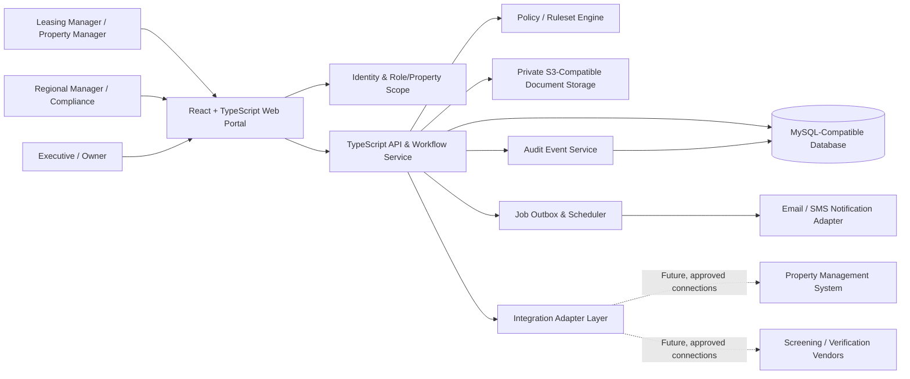
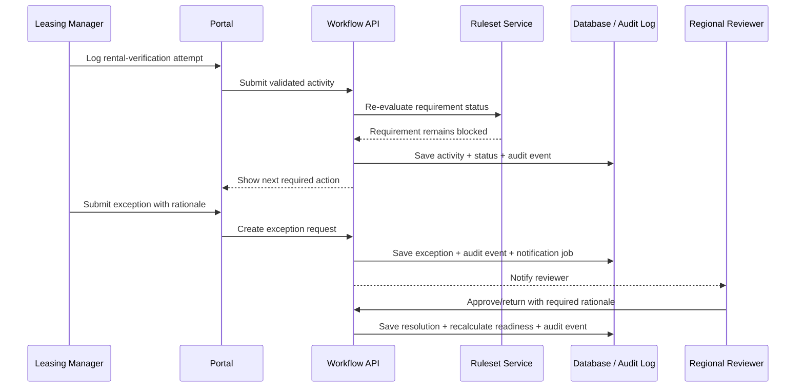

# LeaseGuard MVP: Technical Architecture and Technology Stack

## 1. Architecture Objective

LeaseGuard should be built as a **secure workflow and evidence-management application**, not as an automated resident-approval engine. The MVP should make it easy to create an applicant file, bind it to a versioned property/program ruleset, collect evidence, record verification activities, route policy exceptions, and preserve an audit-ready human decision record.

The MVP is intentionally designed for a pilot at two properties: one conventional community and one regulated/affordable community. It should minimize integration dependency at launch while leaving clean interfaces for later connections to property-management, screening, messaging, and document systems.

> **Design decision:** The application calculates policy-defined readiness and identifies incomplete requirements. It never produces an unreviewed autonomous approval or denial.

## 2. Recommended MVP Stack

The recommended stack is TypeScript end-to-end, with a relational system of record and private object storage for evidence. This keeps delivery fast, supports structured audit data, and aligns well with the portal’s ruleset-driven workflow.

| Layer | MVP recommendation | Purpose and selection rationale |
|---|---|---|
| Web application | React + TypeScript + Vite | Fast, strongly typed interface for responsive queue, file-review, and administrative screens. |
| Component system | Tailwind CSS + accessible component primitives | Consistent design tokens, accessible status controls, compact tables, dialog workflows, and responsive layouts. |
| Client data | TanStack Query + React Hook Form + Zod | Server-state caching, robust forms, and shared typed validation. |
| API | TypeScript service layer with REST/JSON endpoints | Clear separation between UI and business workflow; easy to expose later to approved integrations. |
| Domain validation | Zod schemas and server-side policy guards | Validates every mutation independently of the browser. |
| Primary data store | MySQL-compatible relational database, preferably TiDB/MySQL for the managed MVP | Stores applications, rulesets, verification activities, approvals, access scope, and audit events with transactions and relational integrity. |
| Data access and migrations | Drizzle ORM + migration tooling | Type-safe schema access and versioned database changes; Drizzle supports MySQL through its `mysql2` integration.[1] |
| Private document storage | S3-compatible object storage with time-limited signed URLs | Stores pay stubs, verification evidence, generated decision packets, and notices outside the primary database; S3-compatible storage allows a portable object interface.[2] |
| Identity and access | SSO-ready authentication with application-managed RBAC | Maps authenticated users to organization, region, property, and role scopes. Start with the available project authentication and keep an adapter for Entra ID/Google Workspace SSO. |
| Notifications | Transactional email provider plus optional SMS provider | Sends task reminders, exception alerts, and verification templates; provider implementation is hidden behind an adapter. |
| Background work | Database-backed job/outbox table plus scheduled worker | Reliably processes reminders, exports, and retryable integration syncs without requiring a complex queue platform on day one. |
| Observability | Structured application logs, error tracking, audit-event explorer, and health checks | Supports pilot troubleshooting without putting applicant PII into third-party logs. |
| Delivery | Containerized service, CI/CD pipeline, managed database, private object storage | Supports test, pilot, and production environments with reproducible deployment. |

**Why not begin with a predictive model?** The first release does not need it. The business problem is incomplete, inconsistent, or unsupported file review. The MVP should first create dependable evidence and outcome data; only after policy, adoption, and data-quality review should the team consider analytical enhancements.

## 3. High-Level Architecture

The browser is intentionally thin: it renders forms, queues, dashboards, and evidence previews. All decisions about access, ruleset evaluation, status transitions, task generation, and audit events occur in the server-side workflow service. This prevents a user from bypassing policy by manipulating front-end state or directly calling an unprotected endpoint.

## 4. Core Application Modules

| Module | MVP responsibility | Explicitly out of scope for MVP |
|---|---|---|
| Identity and scope | Authenticate users; enforce organization, region, property, and role boundaries | Consumer-facing applicant accounts or self-service portal |
| Application intake | Create applicant/household record; link property, unit, rent, program, and ruleset | Full replacement of a property-management leasing platform |
| Ruleset engine | Select an effective ruleset and evaluate requirement completion/status | Machine-learning underwriting or opaque risk scoring |
| Verification workspace | Capture structured employment/rental verification activities, notes, outcomes, and attachments | Automated third-party verification connections at day one |
| Document evidence | Upload, classify, view, retain, and securely share file evidence | General-purpose document-management system |
| Exception workflow | Submit a policy exception; route it; record reviewer rationale and outcome | Site-level silent overrides |
| Decision packet | Produce a frozen file summary showing evidence, policy version, decision, and timeline | Legal determination of applicant eligibility |
| Portfolio dashboard | Measure work queue, readiness, exceptions, completion, and approved aggregate outcome trends | Causal financial modeling or individual risk prediction |
| Administration | Maintain properties, programs, rulesets, templates, assignments, and roles | Uncontrolled ad hoc policy editing by site staff |

## 5. Domain Model

The relational model separates **policy**, **file evidence**, and **human decision history**. The following entities provide an MVP that is both operationally usable and auditable.

| Entity | Key fields | Relationships and notes |
|---|---|---|
| Organization | `id`, `name`, `timezone`, `status` | Tenant boundary; parent of users, properties, rulesets, and files. |
| Property | `id`, `organization_id`, `region_id`, `program_profile`, `status` | Determines which rulesets and users may apply. |
| User | `id`, `organization_id`, identity-provider subject, `status` | Holds no authorization in isolation; access comes from assignments. |
| RoleAssignment | `user_id`, `role`, `region_id?`, `property_id?`, effective dates | Defines least-privilege scope for every action. |
| Application | `id`, `organization_id`, `property_id`, `unit_ref`, `status`, `ruleset_version_id`, intake timestamps | The central file; immutable binding to the chosen ruleset version after intake. |
| HouseholdMember | `application_id`, permitted identity/contact fields, employment/income summary | PII is minimized, classified, and protected; documents retain supporting details. |
| RulesetVersion | `id`, `program_type`, `version`, effective dates, approval metadata, published status | Versioned and never silently changed after use on an application. |
| RequirementDefinition | `ruleset_version_id`, code, label, type, required/conditional logic, ordering | Examples: income evidence, job-tenure record, rental verification, program document. |
| RequirementEvaluation | `application_id`, `requirement_id`, status, computed data, reviewer status | Captures `complete`, `attention`, `blocked`, `exception_required`, or `not_applicable`. |
| VerificationActivity | `application_id`, type, method, target, timestamp, outcome, owner, notes | Structured log of contacts/attempts; attachments point to stored evidence. |
| Document | `application_id`, type, storage key, checksum, uploader, retention class, scan status | Stores metadata only; actual bytes remain in private object storage. |
| ExceptionRequest | `application_id`, requirement, rationale, submitted by, state, reviewer, resolution | Keeps exception decisions separate from standard readiness completion. |
| Decision | `application_id`, authorized actor, state, rationale, policy version, finalized timestamp | A human-owned decision record, not an automated recommendation. |
| AuditEvent | actor, action, object type/id, timestamp, request ID, before/after summary, policy version | Append-only history for sensitive reads, writes, and decision activity. |
| NotificationJob | type, payload reference, destination, schedule time, status, retry count | Drives reminders and alerts through a transactional outbox pattern. |
| OutcomeSnapshot | application reference, permitted aggregate/operational outcome fields, measured date | Optional after pilot; used only for approved operational reporting and policy review. |

## 6. Workflow and State Model

The application file should move through a small number of explicit states. Each state change is server-authorized, validated against the ruleset, and written to the audit log.

| State | Meaning | Authorized transition |
|---|---|---|
| `draft` | Intake is being entered; application is not yet ready for active review | Leasing/property manager creates or updates the file |
| `in_review` | Ruleset is bound and work items are active | System or assigned manager activates the file |
| `blocked` | A required item is missing, failed, or needs documented follow-up | System derives state from requirement evaluations |
| `exception_pending` | A requirement does not meet policy and has been routed for authorized review | Leasing/property manager submits; regional/compliance reviewer resolves |
| `ready_for_decision` | Required checks are complete or valid exceptions are resolved | System calculates readiness; property manager assigns reviewer |
| `finalized` | Authorized human decision and required documentation have been recorded | Delegated decision-maker finalizes |
| `archived` | Retention/closure state with strictly limited access | System administrator or retention workflow, with audit event |

### Controlled State Transition

## 7. API Surface for the MVP

The API should be REST/JSON, versioned from the beginning, and protected by server-side authorization middleware. Every route checks organization scope, property/region assignment, role, application state, and policy-transition permissions before it reads or changes data.

| Endpoint group | Examples | Purpose |
|---|---|---|
| Authentication and profile | `GET /v1/me`, `GET /v1/me/assignments` | Exposes the signed-in user and safe scope context. |
| Dashboard | `GET /v1/dashboard/my-work`, `GET /v1/dashboard/property-summary` | Returns queue and aggregate KPI data appropriate to the caller’s role. |
| Applications | `POST /v1/applications`, `GET /v1/applications`, `GET /v1/applications/:id` | Creates and retrieves scoped applicant files. |
| Requirements | `GET /v1/applications/:id/readiness`, `PATCH /v1/applications/:id/requirements/:code` | Renders checklist status and records policy-defined review facts. |
| Verification | `POST /v1/applications/:id/verifications` | Records structured verification attempts and outcomes. |
| Documents | `POST /v1/applications/:id/documents/upload-url`, `POST /v1/applications/:id/documents/complete` | Uses time-limited upload URLs and records metadata after scan/validation. |
| Exceptions | `POST /v1/applications/:id/exceptions`, `POST /v1/exceptions/:id/decision` | Manages submission, return, approval, and required rationales. |
| Decisions | `POST /v1/applications/:id/finalize` | Finalizes a human decision only if user authority and file state permit it. |
| Reports | `POST /v1/reports/decision-packet`, `GET /v1/reports/portfolio` | Generates access-scoped packets and aggregated dashboard extracts. |
| Administration | `POST /v1/rulesets`, `POST /v1/rulesets/:id/publish`, `PATCH /v1/assignments` | Restricts policy and access changes to appropriate administrative roles. |

## 8. Security and Privacy Baseline

LeaseGuard will contain sensitive applicant and employment/rental information. The MVP should apply security controls by default rather than adding them after pilot data exists.

| Control area | MVP control |
|---|---|
| Authentication | Use managed identity; support MFA through the identity provider; expire sessions; re-authenticate for sensitive administrative actions. |
| Authorization | Enforce role, organization, region, and property scope server-side on every request; deny by default. |
| Data minimization | Store only what is needed for the workflow; avoid putting applicant PII in email, analytics, error logs, or executive dashboards. |
| Document security | Store evidence in private buckets; issue short-lived signed URLs; validate file type/size; perform malware scanning before making documents available. |
| Encryption | TLS in transit; managed encryption at rest for database and object storage; separate production secrets from code. |
| Auditability | Create append-only audit events for access, upload, verification, policy, exception, and decision actions; surface an authorized event viewer. |
| Ruleset integrity | Version, approval-date, and effective-date every ruleset; bind the selected version to the file at intake; prohibit retroactive overwrite. |
| Retention | Configure retention schedules by organization/program policy; make deletion/archiving jobs auditable and access-controlled. |
| Observability | Use request IDs and structured events; redact sensitive fields before error reporting; maintain administrator access logs. |
| Backups and recovery | Perform encrypted database backups, test restoration, and define recovery objectives before the pilot holds active files. |

No dashboard, checklist, or score should be used as a substitute for approved written policies and qualified compliance/legal oversight. If the organization later connects consumer-reporting or screening vendors, that work should be separately scoped with vendor due diligence, security review, consent/notice workflow, and policy approval.

## 9. Integration Strategy

The first release should launch with manual/CSV intake and generated decision packets. This avoids the common failure mode of waiting for complex third-party integrations before testing whether managers will use the workflow.

| Stage | Integration approach | Value |
|---|---|---|
| MVP pilot | Manual file creation, CSV import, controlled document upload, email templates | Tests the workflow and ruleset with minimal dependency risk. |
| Phase 2 | One-way import from the selected property-management/application system | Reduces duplicate entry of applicant, unit, rent, and property metadata. |
| Phase 3 | Approved screening/verification vendor adapters | Pulls permitted screening results or verification status into structured evidence records. |
| Phase 4 | Outbound decision/status synchronization and approved outcome feeds | Keeps the system of record aligned while enabling aggregate outcome analysis. |

Implement an **adapter interface** rather than calling a vendor API directly from core application code. For example, `PropertyManagementAdapter`, `ScreeningAdapter`, `MessagingAdapter`, and `StorageAdapter` isolate credentials, mapping, retry logic, and vendor-specific failure behavior. This reduces lock-in and makes an integration switch a contained engineering change.

## 10. Deployment Topology

A practical delivery path is a web application with a separate production environment, managed database, private document storage, and a scheduled worker. The same architecture can begin inside a full-stack project scaffold and later move to a dedicated cloud account without redesigning the domain model.

| Environment | Purpose | Guardrails |
|---|---|---|
| Local development | Developer testing using synthetic data only | No production credentials or applicant documents. |
| Staging | End-to-end testing, user acceptance testing, integration sandbox | Isolated database/storage; synthetic or properly governed test data only. |
| Pilot production | Two-property launch with real users and approved data | Restricted administrator access, monitoring, backups, documented support process. |
| Scaled production | Multi-property rollout | Expanded tenancy controls, SSO, integration monitoring, retention jobs, disaster-recovery testing. |

## 11. MVP Delivery Plan

| Sprint | Primary outcome | Exit criteria |
|---|---|---|
| 0: Discovery | Approved workflow/ruleset definition for two pilot properties | Roles, evidence standards, exception authorities, and success metrics signed off. |
| 1: Foundation | Authentication, property-scoped RBAC, core data model, audit events | Users can log in and see only authorized properties. |
| 2: File workflow | Intake, ruleset binding, checklist, verification log, document upload | A manager can complete a realistic synthetic file end to end. |
| 3: Review workflow | Exception routing, human decision capture, decision packet | An authorized reviewer can approve/return a file with a complete timeline. |
| 4: Management view | My Work queue, property dashboard, exportable pilot metrics | Pilot managers can identify blocked files and bottlenecks in one screen. |
| 5: Pilot hardening | Security review, retention configuration, user acceptance testing, training | Two properties can begin a controlled pilot with support coverage. |

## 12. Decisions to Settle Before Development

The following decisions will materially affect the ruleset engine and should be approved in the discovery workshop before the team writes production logic.

| Decision | Owner | Why it matters |
|---|---|---|
| Exact program/property classifications | Operations and compliance | Determines which ruleset applies at intake. |
| Required evidence and acceptable alternatives | Compliance and legal/policy owners | Defines when a requirement is complete, blocked, or eligible for exception. |
| Delegated approval levels | Leadership and compliance | Governs which role can finalize standard files and exceptions. |
| Retention/archival schedule | Compliance, legal, and records owner | Determines storage cost, deletion logic, and audit access. |
| Initial property-management/application system | Operations and IT | Determines the Phase 2 integration adapter and data map. |
| Messaging policy and approved templates | Operations and compliance | Governs communication content, consent, and channel use. |
| Pilot success metrics | Leslie and executive sponsor | Keeps the pilot focused on adoption and file quality, not speculative scoring accuracy. |

## References

[1]: https://orm.drizzle.team/docs/mysql/get-started-mysql "Drizzle ORM: MySQL integration"
[2]: https://developers.cloudflare.com/r2/api/s3/api/ "Cloudflare R2: S3 API compatibility"
