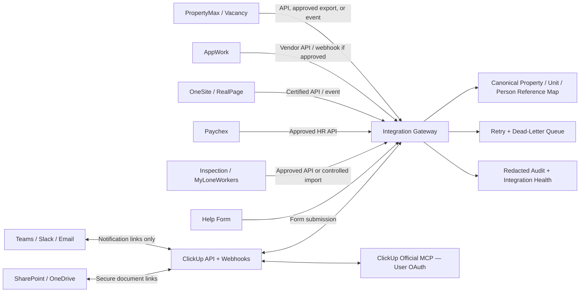
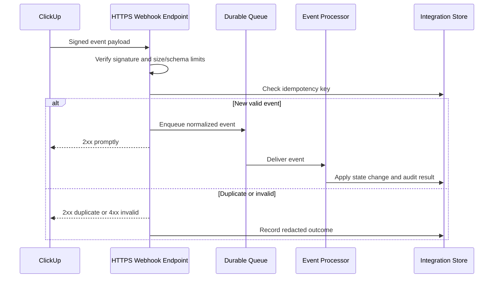

# PropertyMax–ClickUp Integration, API-Key, and MCP-Server Model

## Integration objective

The integration layer should move only the **minimum operational data needed to assign, monitor, escalate, and close work**. PropertyMax, Vacancy, AppWork, OneSite/RealPage, Paychex, and inspection platforms remain authoritative for their specialized records. ClickUp receives normalized references, milestones, exception states, owners, deadlines, and secure deep links. It does not become a duplicate payroll, resident-ledger, applicant-screening, or unrestricted document repository.

The recommended design distinguishes five mechanisms:

| Mechanism | Use it for | Do not use it for | Example |
|---|---|---|---|
| Native ClickUp integration | Low-code notifications and standard collaboration | Complex source reconciliation or sensitive data replication | Teams/Slack task previews |
| Direct REST API | Deterministic reads/writes with known schemas | Human judgment or poorly documented source behavior | Create/update a Vacancy Case from a normalized event |
| Webhook | Timely source or ClickUp change notification | Bulk historical loading or a source that does not document webhook support | Task status update triggers an integration event |
| Scheduled reconciliation | Catching missed events, low-frequency sources, and audit comparison | Sub-minute monitoring | Nightly source-to-ClickUp count and field comparison |
| MCP server | User-authorized AI search, drafting, and controlled tool actions | High-volume synchronization, unattended system-of-record replication, or actions without clear confirmation | An authorized assistant searches ClickUp and drafts a regional brief |

> **Architecture rule:** Use REST APIs and webhooks for deterministic system synchronization. Use MCP for human-directed, permission-aware assistance. Do not treat an MCP server as a background integration bus.

## Viable implementation approaches

At least two approaches are viable. The final choice depends on event volume, latency, vendor access, internal support capacity, and the need for a management interface.

| Approach | Tradeoffs | Cost | Setup complexity |
|---|---|---|---|
| **Native connectors plus low-code orchestration** | Fastest pilot; familiar to operations; strong for forms, email, Teams, SharePoint, and routine task creation. Harder to version, test, and reconcile as transformations grow. Vendor-specific connectors may be limited. | Existing Microsoft/ClickUp licensing plus possible connector-plan fees | Low to medium |
| **Managed integration service with webhook handlers and scheduled reconciliation** | Stronger schema control, idempotency, observability, test environments, and a future admin UI. Requires development ownership and release discipline. | Managed hosting plus implementation effort; periodic jobs can start with modest operating cost | Medium to high |
| **AI-assisted operations through approved MCP servers, paired with either approach above** | Excellent for search, summarization, task drafting, controlled updates, and executive preparation. It does not replace deterministic synchronization and requires careful user consent, tool allowlisting, and audit review. | Client/platform licensing and usage; depends on chosen assistant | Medium |

The lighter pilot is native connectors/Power Automate plus manual source links. The more durable model is a managed integration service receiving verified webhooks, applying a canonical mapping, and performing nightly reconciliation. MCP can be added independently after the core permissions and human-confirmation rules are stable.

## Target logical architecture



The gateway may initially be a controlled Power Automate solution and later become a managed integration application. In either form, it needs the same controls: environment separation, schema validation, idempotency, retries, dead-letter handling, audit records, and reconciliation.

## Canonical record envelope

Every source event should be normalized before it updates ClickUp. A canonical envelope prevents each connector from inventing its own identifiers and error behavior.

```json
{
  "event_id": "source:event-or-history-id",
  "event_type": "vacancy.milestone_changed",
  "occurred_at": "2026-07-14T17:00:00Z",
  "source_system": "propertymax-vacancy",
  "source_record_id": "VAC-12345",
  "property_id": "PROP-0017",
  "unit_id": "UNIT-0017-0214",
  "subject_reference": null,
  "classification": "internal-operational",
  "changed_fields": {
    "readiness_percent": 82,
    "target_move_in": "2026-07-15"
  },
  "source_url": "https://approved-source.example/record/12345",
  "correlation_id": "corr-uuid",
  "schema_version": "1.0"
}
```

This object must not carry secrets. Resident or employee identifiers should be opaque source references unless an approved use case requires more. Field allowlists should reject unapproved payload attributes rather than silently storing them.

## Software-by-software integration matrix

| System | Confirmed availability | System-of-record role | ClickUp receives | Preferred connection | Credential pattern | First setup task |
|---|---|---|---|---|---|---|
| PropertyMax core | Visible REST documentation exposes `GET /rest/max/users/{token}`; no visible write endpoints | Calls, directories, operational signals, portfolio context | User/role mapping if approved; call or exception references only when supported | Start read-only; request formal API specification and non-URL token mechanism | Vendor-issued service credential; avoid token in URL if a header-based option exists | Obtain API owner, OpenAPI/specification, rate limits, token scopes, and staging endpoint |
| PropertyMax Vacancy | Authenticated UI confirms vacancy, on-notice, eviction, readiness, manager, dates, and notes; public API not confirmed | Vacancy and milestone source | Vacancy Case fields, milestone changes, blocker signals, source link | Approved API/export/event if provided; otherwise controlled scheduled extract, not screen automation | Separate read-only service credential | Define approved field list and change-detection method |
| Help portal | Structured form and Admin View confirmed | Help/training intake | Help Request, children for multiple issues, routing fields, attachments or secure links | Replace/bridge with ClickUp Form or send form webhook to integration gateway | Form secret or service identity if API exists | Decide whether ClickUp Form becomes canonical intake |
| Operations Hub | Reporting site referencing PropertyMax/Vacancy, scheduled reports, SharePoint, and Power Automate | Management reporting and links | Dashboard URLs, report exceptions, scheduled-report completion | Prefer source-level integrations; avoid scraping the rendered dashboard | Power Automate connection references and source credentials | Inventory each Hub metric and authoritative source |
| AppWork | Vendor states an open API; internal access not inspected | Maintenance work-order source | Work-order ID, status, priority, property/unit, assignment, dates, turn link, approved evidence link | Vendor API; webhook only after vendor confirmation | Vendor OAuth/service account/API key as documented | Request API documentation, sandbox, scopes, rate limits, and event support |
| AppWork–Admin / MyLoneWorkers | Login destination confirmed; API not confirmed | Lone-worker safety, patrol, inspection evidence | Safety exception, patrol/inspection reference, severity, responsible lead, due date | Vendor-approved API or controlled import; no assumed webhook | Dedicated service account if vendor permits | Request vendor integration documentation and data-processing review |
| Inspections | PropertyMax dashboard plus MyLoneWorkers route confirmed | Inspection schedule/findings/evidence | Inspection reference, property/unit, severity, due date, remediation, reinspection | Approved API/export; critical findings may create ClickUp tasks | Read-only or event-specific credential | Separate inspection workflow from lone-worker monitoring |
| OneSite / RealPage | Official developer portal and partner/certification model confirmed | Resident, applicant, financial, property-management records | Opaque reference ID, operational status/amount, due date, secure deep link | Certified RealPage API/event integration | OAuth/client credentials or vendor-issued app identity per approved product | Open vendor onboarding and define minimum data contract |
| Paychex Flex | Official developer center confirmed; tenant endpoints/scopes require onboarding | HR/payroll/time data | Onboarding/offboarding milestones, training/access tasks, approved time-off event reference | Approved Paychex API; avoid payroll-detail replication | OAuth/client credentials or approved service identity | Confirm tenant eligibility, scopes, and HR/legal approval |
| ClickUp | Official API, webhooks, OAuth, personal tokens, and official MCP server confirmed | System of action | Tasks, fields, relationships, comments, Docs, dashboard source data | API/webhooks for automation; OAuth MCP for user-driven AI assistance | OAuth for multi-user apps; dedicated non-personal integration owner where possible | Create staging Workspace/Space and integration app registration |
| Teams or Slack | Native ClickUp integrations documented | Discussion and notification surface | Task previews, mentions, links, approved alerts | Native integration first | OAuth connection owned by collaboration administrator | Select one primary collaboration surface; prevent duplicate assignment |
| Outlook/email | Microsoft environment is indicated by SharePoint/Power Automate use | Formal internal/external communication | Approved digest or task link; inbound message may create triage task | Power Automate or Microsoft Graph depending scale | OAuth application with least-privilege mail scopes | Define approved sender, mailbox, recipient, and retention rules |
| SharePoint/OneDrive | Operations Hub links to a SharePoint workbook | Document system of record | Secure document links, metadata, review/expiration tasks | Power Automate or Microsoft Graph | OAuth application/managed identity | Create approved library and metadata standard; never use public links |
| Power BI or reporting layer | Not directly inspected; compatible with existing Microsoft environment | Curated analytical reporting | Aggregated ClickUp/source metrics | Approved connector, export, or warehouse feed | Service principal/managed identity | Decide whether ClickUp dashboards or BI owns each metric |

## PropertyMax API setup procedure

The currently visible PropertyMax documentation exposes one read route with a token in the path. This is enough to prove a REST surface exists, but not enough to design a production synchronization contract. Before implementation:

| Step | Owner | Required result |
|---|---|---|
| 1. Identify the API owner | PropertyMax product owner | Named business and technical contacts |
| 2. Request formal documentation | Integration engineer | Endpoint catalog, schemas, error codes, limits, environments, versioning, and support process |
| 3. Clarify token transport | Security and vendor | Prefer `Authorization` header; if path token is unavoidable, prevent proxy/access logs from storing it |
| 4. Request a non-human service identity | Vendor and system owner | Credential independent of an employee account |
| 5. Start read-only | Operations owner | Approved list of fields and allowed properties/regions |
| 6. Build a user/role mapping proof | Data steward | Source user ID mapped to ClickUp member/role without storing passwords |
| 7. Add reconciliation | Integration engineer | Source count, received count, accepted count, rejected count, and discrepancy tasks |
| 8. Evaluate additional endpoints | Product owner | Vacancy, calls, directory, request, inspection, and report endpoints prioritized by business value |

Until an official write API is documented and approved, ClickUp should not attempt to write back to PropertyMax. Users should follow secure deep links for source changes.

## ClickUp API authentication pattern

ClickUp documents two API authentication choices: personal tokens and OAuth 2.0. Personal tokens are useful for individual testing, but they do not expire automatically. OAuth authorization-code flow is appropriate for an application used by multiple people.[1]

| Context | Authentication choice | Required control |
|---|---|---|
| Developer proof of concept | Personal token in a secret manager | Test Workspace only; restricted user; manual 30-day review; revoke after proof |
| Production single-organization integration | OAuth or a dedicated integration identity, subject to ClickUp account design | Non-human ownership where possible; minimum permissions; documented recovery owner |
| Multi-user assistant or app | OAuth authorization-code flow | Per-user consent, redirect URI allowlist, token encryption, revocation handling |
| Official ClickUp MCP | OAuth only | User-specific authorization, approved client, tool allowlist, human confirmation for writes |

Do not embed a ClickUp token in browser JavaScript, a static portal, a task description, a ClickUp Doc, source code, a spreadsheet, or a Power Automate comment. A backend or managed connector retrieves the secret at runtime.

## ClickUp webhook design

ClickUp webhooks can subscribe to events at one hierarchy location. Each webhook belongs to the user whose token created it, stops triggering if that user is disabled or loses access, and is signed with a webhook-specific shared secret. ClickUp recommends HTTPS and `webhook_id:history_item_id` as the idempotency key.[2]

### Receive sequence



### Required controls

| Control | Implementation requirement |
|---|---|
| HTTPS | Reject production callbacks over plain HTTP |
| Signature verification | Validate against the stored webhook-specific secret before processing |
| Idempotency | Store `webhook_id:history_item_id` or an approved fallback key |
| Rapid acknowledgement | Validate and enqueue, then return; do not perform slow vendor calls in the request thread |
| Payload allowlist | Accept documented event types and fields only |
| Replay window | Reject stale events beyond the approved tolerance when timestamps are available |
| Retry | Exponential backoff with jitter and a maximum-attempt policy |
| Dead-letter | Create an Integration Error after terminal failure |
| Ownership | Inventory the creating user/integration identity and test disablement recovery |
| Reconciliation | Compare ClickUp/source counts and critical fields on a schedule |
| Logging | Store correlation IDs and outcomes; redact tokens, resident detail, payroll data, and attachments |

## API-key and secret lifecycle

### Secret classifications

| Secret type | Example | Storage | Rotation trigger |
|---|---|---|---|
| API key/personal token | ClickUp proof token, vendor key | Enterprise secret manager or managed platform secret store | Scheduled policy, role change, suspected exposure, vendor event |
| OAuth client secret | Registered confidential application | Secret manager; backend only | Scheduled policy and immediately after suspected exposure |
| OAuth access/refresh token | Per-user or service authorization | Encrypted token store with strict service access | Expiration, revocation, consent change, user disablement |
| Webhook signing secret | ClickUp webhook secret | Secret manager keyed by webhook ID | Webhook recreation, compromise, ownership change |
| MCP server credential | Prefer OAuth for HTTP MCP; environment credential for approved local STDIO server | Approved encrypted client store/environment | Authorization revocation, device/user change, compromise |

### Creation workflow

1. The business owner submits an **Integration Access Request** in ClickUp with purpose, systems, data classification, environments, read/write actions, expected volume, and expiration/review date.
2. The source-system owner approves the fields and operations. Security approves authentication, secret storage, network path, and logging. The integration owner confirms a recovery owner.
3. An administrator creates the app/service identity directly in the vendor portal. Credentials are never pasted into the ClickUp request.
4. The administrator stores the secret in the approved vault and records only the vault reference, owner, environment, issue date, review date, and last four characters/fingerprint in ClickUp.
5. The runtime receives the secret through an environment binding or connection reference. Developers do not copy production secrets to local `.env` files.
6. The integration passes sandbox functional, negative, security, load, and reconciliation tests before production authorization.

### Rotation workflow

| Phase | Action | Evidence |
|---|---|---|
| Prepare | Create replacement credential with same or narrower scopes | New vault version and approved change task |
| Dual-run if supported | Configure runtime to accept/use new credential while old remains valid | Successful health check and sample transaction |
| Cut over | Activate new credential in production connection | Deployment/change record |
| Verify | Confirm webhook/API success, reconciliation, and no authentication failures | Integration Health dashboard and test case |
| Revoke | Revoke old credential at vendor | Revocation timestamp and administrator confirmation |
| Close | Update inventory and next review date | Integration Registry updated |

Rotation intervals should be set by organizational policy and vendor capability, not copied from a generic number. Non-expiring personal tokens require a stricter manual review because the platform will not expire them automatically.

### Exposure response

If a secret appears in a task, comment, email, screenshot, log, repository, or browser client, treat it as compromised. Stop the integration if necessary, revoke the credential at the source, issue a replacement, search approved logs/repositories for reuse, review actions performed by the credential, document impact, and close only after verification. Editing the visible message is not sufficient because history, caches, and logs may retain the secret.

## MCP-server governance

The ClickUp official MCP endpoint is `https://mcp.clickup.com/mcp`, is described as public beta, and uses OAuth rather than API keys. It applies the authenticated user's ClickUp permissions. Supported capabilities include search, task and hierarchy operations, comments, attachments, custom fields, relationships, time tracking, members, Chat, and Docs.[3] [4]

### Approved MCP use cases

| Use case | Tool posture | Confirmation |
|---|---|---|
| Search tasks, Docs, or comments for a regional briefing | Read-only | No confirmation after user chooses scope |
| Draft a weekly operations brief | Read-only plus draft generation | Human reviews before distribution |
| Create tasks from an approved meeting decision list | Write | Show task names, Lists, owners, and dates before execution |
| Update routine fields under a deterministic rule | Narrow write | Pilot requires confirmation; later may be allowlisted |
| Send a ClickUp Chat message | Communication write | Always confirm during pilot; restricted content rules apply |
| Bulk update or delete work | High-impact write | Explicit human confirmation every time; deletion normally disabled |

### MCP approval checklist

| Review area | Required question |
|---|---|
| Server identity | Is the endpoint vendor-owned or internally approved, and is its TLS/domain identity verified? |
| Transport | Is it HTTPS MCP with OAuth or a controlled local STDIO server? |
| Authorization | Does it use OAuth 2.1/PKCE or another approved enterprise mechanism? |
| Tools | Which exact tools are exposed? Are read and write tools separable? |
| Scopes | Are scopes limited to the required workspace, data, and operations? |
| Data | Can prompts or tool results contain resident, HR, payroll, legal, or credential data? |
| Confirmation | Which tools require human confirmation before execution? |
| Logging | Are user, tool, arguments classification, result, timestamp, and correlation ID audited without secrets? |
| Prompt-injection defense | Are external text and attachments treated as untrusted data rather than instructions? |
| Lifecycle | Who can authorize, review, revoke, and test the connection? |

### MCP connection procedure

1. Register the MCP client in the approved client inventory and assign a business owner, technical owner, data classification, and review date.
2. Verify the exact server URL from official vendor documentation. Do not connect to a lookalike endpoint received through an email or task attachment.
3. Review the server's available tools before authorization. Deny broad or destructive tools that are not required.
4. Complete OAuth in the browser under the intended user or approved service pattern. Review requested scopes and abort if they exceed the approved design.
5. Test read-only discovery in a staging Space. Confirm that inaccessible tasks remain inaccessible.
6. Enable one low-risk write tool at a time. Require a preview and explicit confirmation.
7. Record the authorization date, user, scopes, client, server, approved tools, and revocation procedure in the Integration Registry. Do not record tokens.
8. Review access quarterly and immediately after role changes, client compromise, vendor incidents, or material tool-catalog changes.

### Custom MCP server requirements

If PropertyMax later exposes a custom MCP server, it should wrap approved business capabilities rather than expose a raw database or unrestricted generic HTTP tool. Each tool should have a narrow name and schema such as `get_vacancy_exception`, `list_property_attention_items`, or `create_help_request`. HTTP-based authorization should follow the MCP authorization specification's OAuth patterns, including protected-resource metadata, short-lived tokens, token audience validation, HTTPS, and least-privilege scopes. The official MCP guidance also recommends validated tokens, encrypted storage, credential redaction, and a proper secret manager.[5] [6]

| Unsafe tool | Safer alternative |
|---|---|
| `run_sql(query)` | `list_vacancy_cases(property_id, status, limit)` |
| `http_request(url, method, body)` | Vendor-specific allowlisted operations |
| `update_any_record(type, id, fields)` | Narrow tools with field schemas and role checks |
| `send_message(channel, text)` | `draft_message` plus separate confirmed `send_approved_message` |
| `download_file(url)` | Retrieve only approved source attachment IDs with malware/content controls |

## Data-minimization matrix

| Data class | ClickUp task field/comment | Secure source link | Integration log | MCP prompt/result |
|---|---|---|---|---|
| Property/unit operational metadata | Allowed | Allowed | IDs and status allowed | Allowed within authorized scope |
| Work-order status and approved evidence reference | Allowed | Preferred for detailed evidence | Reference and outcome only | Allowed when needed |
| Resident/applicant name and contact detail | Minimize; use opaque reference where possible | Preferred | Redact | Only when explicitly authorized and necessary |
| Full ledger, screening, legal file | Prohibited by default | Required | Prohibited | Prohibited by default |
| Payroll, tax, bank, SSN, compensation | Prohibited | Required source system | Prohibited | Prohibited |
| API keys, OAuth tokens, passwords, webhook secrets | Prohibited | Prohibited | Prohibited/redacted | Prohibited |
| HR performance/disciplinary material | Restricted private workflow only if approved | Preferred | Reference only | Human-controlled and restricted |

## Integration Registry fields

Create an **Integration Registry** List in the Integration & Data Governance Space.

| Field | Purpose |
|---|---|
| Integration Name | Human-readable connector name |
| Source / Destination | Systems and direction |
| Business Owner / Technical Owner / Backup | Accountability and recovery |
| Environment | Development, test, staging, production |
| Mechanism | API, webhook, scheduled file, native connector, MCP |
| Authentication Type | OAuth, service identity, API key, managed identity, webhook secret |
| Secret Reference | Vault path/connection name only; never secret value |
| Scopes / Approved Actions | Read/write boundaries |
| Data Classification | Operational, resident-sensitive, HR-sensitive, financial, public |
| Trigger / Frequency | Event, hourly, nightly, manual, user-directed |
| Source Identifier / ClickUp Mapping | Object and ID contract |
| Idempotency Strategy | Unique event/correlation key |
| Retry / Dead-Letter Policy | Attempts, delay, terminal handling |
| Monitoring Dashboard | Health and reconciliation link |
| Last Successful Run / Last Reconciliation | Operational state |
| Credential Owner / Review Date | Access governance |
| Runbook / Rollback Link | Recovery |
| Status | Proposed, sandbox, pilot, production, paused, retired |

## Test strategy

### Required test suites

| Suite | Example | Pass condition |
|---|---|---|
| Authentication | Expired/revoked token | Request fails safely; no credential appears in logs |
| Authorization | Region 1 integration requests Region 2 record | Denied and audited |
| Schema | Unexpected vendor field or invalid type | Rejected/quarantined; no malformed ClickUp update |
| Idempotency | Same event delivered three times | One resulting business change |
| Ordering | Completion arrives before assignment event | Final state remains correct or event is quarantined |
| Retry | Vendor returns 429/temporary 5xx | Backoff and eventual success within policy |
| Dead-letter | Permanent mapping error | Integration Error created with safe diagnostic context |
| Reconciliation | One source record intentionally omitted | Discrepancy detected and assigned |
| Permission | Guest opens private task/source link | Access denied |
| MCP tool boundary | Assistant attempts unapproved write | Tool unavailable or confirmation blocks execution |
| Communication | Pilot report runs | Only approved recipient receives message; `Test3` marker present |
| Rollback | Mapping release introduces wrong status | Prior mapping restored; affected events replayed safely |

### Environment sequence

| Environment | Data | Allowed recipients | Purpose |
|---|---|---|---|
| Development | Synthetic, non-sensitive records | Developers only | Mapping and unit tests |
| Vendor sandbox/test | Vendor-approved test records | Integration team | Contract and authentication tests |
| Staging | Masked or approved limited real references | System owner only | End-to-end and permission tests |
| Pilot production | One region/property cohort; minimum data | System owner and explicitly approved pilot users | Controlled operational validation |
| Production | Approved portfolio scope | Role/property-based routing | Normal operations with monitoring |

## Error, retry, and reconciliation model

| Condition | Automated response | Human task |
|---|---|---|
| Timeout or 429 | Exponential backoff with jitter | Create task only after threshold or SLA risk |
| Temporary 5xx | Retry within bounded policy | Escalate if vendor outage persists |
| Authentication failure | Stop retries after limited attempts; alert | Integration owner rotates/reauthorizes credential |
| Schema/validation failure | Quarantine event | Data steward resolves mapping or source issue |
| Missing property/unit mapping | Do not create an orphan operational task | Master Data Exception assigned to steward |
| Duplicate event | Return success and no-op | None unless duplicate rate indicates upstream issue |
| Permission denial | Do not broaden permissions automatically | System owner reviews intended scope |
| Reconciliation mismatch | Create Integration Error linked to affected object | Source and ClickUp owners determine authoritative correction |

## Production change control

Every integration change should be a **Mapping or Connector Change** task with business reason, affected systems, field-level before/after behavior, test evidence, release window, monitoring plan, rollback steps, approvers, and post-release result. High-risk changes include new write scopes, resident/HR data fields, new message recipients, bulk operations, and MCP tools that can send communications or delete/update multiple records.

No integration should silently expand its data or permissions because a vendor API returns new fields. Schema changes remain quarantined until reviewed. This protects against unsafe third-party payload consumption and improper API inventory management identified by OWASP.[7]

## References

[1]: https://developer.clickup.com/docs/authentication "ClickUp — Authentication"
[2]: https://developer.clickup.com/docs/webhooks "ClickUp — Webhooks"
[3]: https://developer.clickup.com/docs/connect-an-ai-assistant-to-clickups-mcp-server "ClickUp — Connect an AI assistant to the MCP server"
[4]: https://developer.clickup.com/docs/mcp-tools "ClickUp — Supported MCP tools"
[5]: https://modelcontextprotocol.io/specification/2025-11-25/basic/authorization "Model Context Protocol — Authorization specification"
[6]: https://modelcontextprotocol.io/docs/tutorials/security/authorization "Model Context Protocol — Authorization tutorial"
[7]: https://owasp.org/www-project-api-security/ "OWASP API Security Project"
