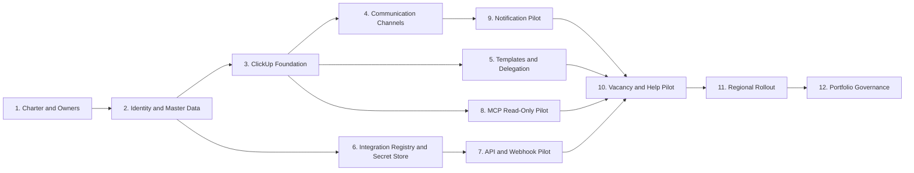

# PropertyMax–ClickUp Implementation Setup Runbook

**Author:** Manus AI  
**Purpose:** Convert the approved ecosystem design into a controlled, testable operating environment without disrupting PropertyMax, Vacancy, AppWork, OneSite/RealPage, Paychex, inspections, or existing communications.

## Setup philosophy

The rollout should establish governance and identifiers before automations. A source record must have a stable property, unit, person/role, and source-system identity before ClickUp can route it safely. Communications should be configured after the task and permission models exist. API and MCP access should be added only after staging, allowlists, human-confirmation rules, secret storage, and rollback procedures are ready.

The implementation is organized as controlled gates. A phase does not proceed merely because its configuration is complete; it proceeds when its acceptance evidence is reviewed by the named owners.

## Setup dependency chart



## Required decisions before configuration

| Decision | Options | Accountable approver | Why it matters |
|---|---|---|---|
| ClickUp plan and feature availability | Confirm Automations, Forms, Chat, Dashboards, permissions, API, and MCP eligibility | Executive sponsor and ClickUp admin | Changes architecture and licensing |
| Pilot scope | One region, one to three properties, or a functional cohort | Operations owner | Limits risk and defines test data |
| Primary collaboration surface | ClickUp Chat, Microsoft Teams, or both with one clearly secondary | Operations owner and Microsoft 365 owner | Prevents duplicate work assignment |
| Integration implementation path | Native/low-code, managed integration service, or staged hybrid | Operations, IT/security, and budget owner | Determines ownership and support model |
| Secret manager | Existing enterprise vault, Microsoft-managed secret store, or approved platform secrets | IT/security | Required before production credentials |
| Property and unit identifier authority | PropertyMax, OneSite/RealPage, or approved master-data table | Data owner | Prevents duplicate and orphan tasks |
| Identity authority | Company employee directory/Microsoft 365 with approved source mapping | HR/IT | Controls assignment and deprovisioning |
| Data boundary | Approved fields per system, including prohibited fields | System owners and security/privacy | Prevents copying sensitive records into ClickUp |
| Pilot notification recipients | Designated owner only until sign-off; include `Test3` marker | Operations owner | Prevents accidental broad messages |

## Implementation work breakdown

### Phase 0 — Charter and readiness, days 1–3

The purpose is to establish authority, scope, and a single decision path before anyone creates Spaces or integrations.

| Setup task | Delegate to | Accountable owner | Deliverable | Acceptance criterion |
|---|---|---|---|---|
| Name executive sponsor, operations owner, ClickUp admin, integration owner, data steward, security reviewer, and pilot regional/property leads | Project coordinator collects confirmations | Executive sponsor | Owner register | Every role has one primary and one backup |
| Confirm pilot properties and functions | Operations analyst prepares recommendation | Operations owner | Pilot-scope decision | Scope includes vacancy and Help; exclusions documented |
| Inventory current tools, licenses, service accounts, and vendor contacts | Integration analyst | Integration owner | System inventory | All green-tab systems have a business and technical contact or an open gap task |
| Approve data classification and prohibited-data table | Security/privacy analyst drafts | Security/privacy owner | Data-handling standard | Payroll, credentials, unrestricted ledgers, and other sensitive fields are explicitly controlled |
| Approve success measures and stop criteria | Analyst prepares baseline | Executive sponsor | Pilot scorecard | Baseline, target, measurement source, and rollback trigger are documented |

**Gate 0:** The executive sponsor approves the charter, pilot scope, owners, data boundary, and go/no-go authority.

### Phase 1 — Identity and master data, days 3–7

| Setup task | Delegate to | Accountable owner | Deliverable | Acceptance criterion |
|---|---|---|---|---|
| Export approved property directory | Data analyst | Data steward | Property mapping table | One canonical Property ID per property; region and manager populated |
| Create unit-reference strategy | Data analyst | Data steward | Unit key rule | Unit IDs remain stable across vacancy and work-order events |
| Map employees to ClickUp users, roles, regions, and properties | HR/IT analyst | HR/IT owner | Identity mapping | No shared employee login; terminated/inactive accounts excluded |
| Define service identities | Integration engineer | System owners and security | Service-account register | Every non-human account has owner, purpose, environment, scopes, and review date |
| Establish exception workflow for unknown IDs | ClickUp admin | Data steward | Master Data Exception List/template | Unmapped records do not create orphan operational tasks |

**Gate 1:** A sample of properties, units, and users reconciles across approved sources, and permission scope can be derived from the mappings.

### Phase 2 — ClickUp foundation, week 2

| Setup task | Delegate to | Accountable owner | Deliverable | Acceptance criterion |
|---|---|---|---|---|
| Create Spaces, Folders, Lists, and standard task types from the ecosystem architecture | ClickUp configurator | ClickUp admin | Staging hierarchy | Naming and inheritance match the blueprint |
| Create global fields | ClickUp configurator | Data steward | Property, Region, Source System, Source Record ID, SLA, Severity, Data Classification, and integration fields | Field definitions and allowed values are documented |
| Create task relationships | ClickUp configurator | Operations owner | Vacancy–turn–work order–finding–help relationships | Sample related records are navigable without duplicated details |
| Configure groups and permissions | ClickUp admin | Data owners | Permission matrix | Property/region users see only approved scope; restricted HR/collections tests pass |
| Configure views and dashboards | Dashboard builder | Functional owners | Role-specific staging views | Users can find their work, overdue exceptions, and source links |
| Create governance Docs | Project coordinator | Operations owner | SOP index, data dictionary, escalation policy, release process | Owners and review dates are visible |

**Gate 2:** The staging Workspace passes a role-based permission walkthrough and contains no production secrets or sensitive test data.

### Phase 3 — Communication channels and operating cadence, week 2

| Setup task | Delegate to | Accountable owner | Deliverable | Acceptance criterion |
|---|---|---|---|---|
| Create approved channels and membership groups | ClickUp admin | Operations owner | Channel set | Public/private scope matches the communication model |
| Pin message anatomy and task-conversion rule | Training coordinator | Operations owner | Pinned standards | Pilot users can explain when a message becomes a task |
| Create meeting Docs and recurring Regional Review tasks | Project coordinator | Regional manager | Daily/weekly/monthly cadence | Meeting outputs generate assigned linked tasks |
| Configure notification defaults | ClickUp admin | Operations owner | Notification profile | Only actionable events are enabled; no broad pilot distribution |
| Define P1 phone/urgent escalation tree | Operations coordinator | Operations and HR | Contact tree | Tree is verified without sending a live emergency alert |
| Lock pilot reports and messages | Integration engineer | Operations owner | Recipient allowlist | Only designated owner is reachable; `Test3` appears in test subject/header |

**Gate 3:** A tabletop scenario proves that routine, at-risk, P1, and executive-incident messages each land in the right channel and ClickUp record without exposing restricted data.

### Phase 4 — Task templates and delegation, week 3

| Template | Initial assignee rule | Required fields | Required checklist | Closure authority |
|---|---|---|---|---|
| Vacancy Case | Property manager by Property ID | Property, Unit, vacancy state, readiness, target date, source link | Validate dates; link turn/work orders; verify move-in readiness | Property manager |
| Turn Workstream | Maintenance supervisor by Property ID | Unit, scope, target ready, priority, source records | Scope; vendor/technician; parts; evidence; quality check | Maintenance supervisor |
| Work Order Exception | Maintenance supervisor or regional maintenance by severity | Source WO ID, category, age, priority, property/unit | Safe state; assignment; blocker; source update; evidence | Maintenance supervisor; P1 may require regional review |
| Inspection Finding | Compliance/maintenance by category | Finding ID, severity, due date, source link | Remediation; evidence; reinspection | Compliance reviewer |
| Help Request | Help coordinator by form category | Category, impact, property/region, submitter, source | Clarify; route; resolve; confirm; knowledge candidate | Functional owner |
| Integration Error | Integration owner by connector | Environment, system, correlation ID, error class, affected count | Contain; diagnose; retry/replay; reconcile; close | Integration owner and affected system owner |
| Access Request | ClickUp admin or system owner | User, role, scope, justification, expiration | Approvals; provision; test; notify; review date | Data/system owner |
| Mapping Change | Integration engineer | Before/after fields, business reason, affected records | Approvals; tests; release; monitor; rollback readiness | Business and technical owners |

Each template should contain **one accountable assignee**, explicit child tasks for cross-functional work, dependency rules, required completion evidence, and a link to the source record. A task should not be reassigned merely because another team contributes; assign a child task or add a watcher while preserving outcome accountability.

**Gate 4:** A power user creates and completes one scenario per template, including an overdue escalation and a rejected closure.

### Phase 5 — Integration governance and credentials, week 3

| Setup task | Delegate to | Accountable owner | Deliverable | Acceptance criterion |
|---|---|---|---|---|
| Create Integration Registry List and request template | ClickUp configurator | Integration owner | Registry and approval workflow | Every proposed connector has owner, mechanism, scopes, data class, secret reference, review date, and rollback link |
| Configure approved secret manager and environments | Security/platform engineer | Security owner | Development, staging, and production secret namespaces | Production secrets are inaccessible to frontend code and general users |
| Register staging ClickUp app or token | Authorized administrator | ClickUp admin | Staging credential | Minimum scope; stored only in vault; expiry/review task created |
| Create webhook inventory and signing-secret storage | Integration engineer | ClickUp admin | Webhook registry | Creating identity, hierarchy location, events, signing secret reference, and disablement recovery are recorded |
| Create vendor access requests | Project coordinator | System owners | PropertyMax, AppWork, RealPage, Paychex, and inspection vendor requests | Official documentation, sandbox, rate limits, scopes, and support contacts requested |

**Gate 5:** A credential can be created, retrieved by the approved runtime, rotated, and revoked without being displayed in ClickUp or committed to source code.

### Phase 6 — API, webhook, and reconciliation pilot, weeks 4–5

| Setup task | Delegate to | Accountable owner | Deliverable | Acceptance criterion |
|---|---|---|---|---|
| Implement canonical event envelope | Integration engineer | Integration owner | Versioned event schema | Invalid/unapproved fields are rejected |
| Implement source-to-ClickUp mapping | Integration engineer with data steward | Business and data owners | Mapping specification | Mapping covers source IDs, ClickUp targets, status translation, and null behavior |
| Implement webhook validation and queue | Integration engineer | Security and integration owners | Signed receiver, idempotency, retry, dead-letter | Duplicate and invalid signatures pass negative tests |
| Implement scheduled reconciliation | Integration engineer | Data steward | Reconciliation job/report | Missing and mismatched records create safe Integration Errors |
| Build Integration Health dashboard | Dashboard builder | Integration owner | Status, latency, failures, retries, dead letters, reconciliation | Dashboard uses no secrets or sensitive payload content |
| Run failure and rollback tests | QA tester | Integration owner | Test evidence | Authentication, rate-limit, schema, outage, duplicate, permission, and rollback tests pass |

**Gate 6:** The pilot connector processes an approved event set repeatedly without duplicates, reconciles expected records, and can be stopped and rolled back.

### Phase 7 — MCP pilot, week 5

| Setup task | Delegate to | Accountable owner | Deliverable | Acceptance criterion |
|---|---|---|---|---|
| Register official server/client information | MCP administrator | Security and ClickUp owner | MCP registry entry | Official URL, owner, OAuth method, approved tools, and revocation procedure recorded |
| Authorize one pilot user with read-only operating procedure | Pilot user with admin observation | ClickUp owner | OAuth authorization | User sees only the same tasks available in ClickUp UI |
| Test search and summary | QA/power user | Operations owner | Test transcript/result | Scope is explicit; restricted tasks do not appear |
| Enable one controlled write action | MCP administrator | Operations and security | Approved write-tool policy | Assistant previews action and obtains human confirmation |
| Test prompt-injection resistance | Security tester | Security owner | Adversarial test evidence | Instructions contained in source text/attachments are treated as untrusted data |
| Test revocation | ClickUp admin/pilot user | ClickUp owner | Revocation evidence | Client can no longer access tools after revocation |

**Gate 7:** Read actions preserve permissions, write actions require the approved confirmation, logs contain safe metadata, and access revokes successfully.

### Phase 8 — Vacancy and Help operational pilot, weeks 6–7

| Workstream | Pilot actions | Success evidence |
|---|---|---|
| Vacancy | Create/link approved Vacancy Cases; route turn blockers; review at-risk move-ins; reconcile source references | No orphan units; owners and target dates present; source remains authoritative |
| Help | Use ClickUp Form or bridge existing Help intake; categorize, assign, resolve, and identify training candidate | Intake-to-owner time, closure quality, and duplicate issue rate are measured |
| Communications | Run daily huddle and weekly regional review using tasks/dashboards | Decisions and assignments are recorded; no action exists only in Chat |
| Automations | Enable only approved routing, due-date, and escalation rules | Every automation has owner, inventory entry, test case, and disable path |
| Reporting | Produce a draft executive brief | Report uses task links and metrics; test output goes only to approved recipient with `Test3` marker |

**Gate 8:** Pilot users complete two operating cycles, reconcile critical records, and approve the workflow. Any material data, permission, or communication failure pauses expansion.

### Phase 9 — Regional rollout, weeks 8–10

Regional rollout should occur in waves, not through a one-time portfolio switch. Each wave duplicates the approved configuration, imports only approved mappings, trains local leads, completes role-based validation, and runs a short stabilization period.

| Wave task | Delegate to | Approval |
|---|---|---|
| Prepare property/user mappings | Data analyst | Data steward |
| Create region channels and views | ClickUp configurator | Regional manager and ClickUp admin |
| Train property, maintenance, and leasing users | Training coordinator and power users | Operations owner |
| Run day-one checklist and reconciliation | Regional coordinator and integration analyst | Regional manager |
| Monitor adoption and exception quality | Analyst | Operations owner |
| Close stabilization or hold next wave | Project coordinator prepares decision | Executive/operations sponsor |

### Phase 10 — Portfolio governance, week 11 onward

| Cadence | Governance action | Owner |
|---|---|---|
| Daily | Review integration failures and critical operational exceptions | Integration and operations owners |
| Weekly | Review overdue work, capacity, pilot/wave issues, and unowned tasks | Regional and functional managers |
| Monthly | Review business KPIs, automation performance, Help themes, and data quality | Operations owner |
| Quarterly | Review access, service identities, API/MCP authorizations, webhooks, secrets, vendor changes, and metric definitions | Security, ClickUp, integration, and system owners |
| Annually or at material change | Reapprove data flows, retention, incident response, and vendor risks | Executive sponsor and governance owners |

## Responsibility assignment matrix

**R** performs the work, **A** owns the outcome and approves, **C** provides required input, and **I** is kept informed. Each activity has one accountable role.

| Activity | Executive Sponsor | Operations Owner | Regional Manager | ClickUp Admin | Integration Engineer | Data Steward | Security/IT | System Owner | Training Lead |
|---|---|---|---|---|---|---|---|---|---|
| Approve scope and funding | A | R | C | I | I | I | C | C | I |
| Approve operating model and SLAs | I | A/R | C | C | I | C | I | C | C |
| Approve data fields and source authority | I | C | C | I | C | R | C | A | I |
| Configure ClickUp hierarchy and templates | I | C | C | A/R | C | C | I | I | C |
| Configure permissions | I | C | C | R | I | C | A | C | I |
| Approve communication channels | I | A | R | C | I | I | C | I | C |
| Issue/approve API access | I | C | I | C | R | C | A | A | I |
| Store and rotate secrets | I | I | I | C | R | I | A | C | I |
| Build mappings/connectors | I | C | I | C | A/R | R | C | C | I |
| Approve MCP tools and scopes | I | C | I | R | C | I | A | C | I |
| Execute tests | I | C | R | R | R | R | C | C | C |
| Approve pilot go-live | A | R | C | C | C | C | C | C | I |
| Train users | I | C | C | C | I | I | I | C | A/R |
| Monitor and reconcile | I | C | C | R | A/R | R | I | C | I |
| Approve regional rollout | A | R | C | C | C | C | C | I | C |
| Revoke compromised access | I | I | I | R | R | I | A | R | I |

## First 30 days: task-by-task schedule

| Day | Task | Owner | Dependency | Evidence |
|---|---|---|---|---|
| 1 | Kickoff; confirm sponsor and operations owner | Executive sponsor | None | Approved charter task |
| 2 | Confirm pilot properties, functions, users, and exclusions | Operations owner | Charter | Pilot-scope Doc |
| 3 | Complete system/vendor inventory and contacts | Integration analyst | Charter | Inventory with gaps |
| 4 | Approve data-classification and prohibited-data rules | Security/system owners | System inventory | Signed data matrix |
| 5 | Approve success metrics, baselines, and stop criteria | Executive/operations | Pilot scope | Scorecard |
| 6 | Produce canonical property and region mapping | Data analyst | Pilot scope | Reconciled property table |
| 7 | Produce unit and user/role mappings | Data/HR analysts | Property mapping | Mapping acceptance tasks |
| 8 | Create staging ClickUp hierarchy | ClickUp configurator | Mappings | Space/List review |
| 9 | Create task types and global fields | ClickUp configurator | Hierarchy | Data dictionary |
| 10 | Configure permissions and run role tests | ClickUp admin | User mapping | Permission test matrix |
| 11 | Create role views and dashboards | Dashboard builder | Fields/permissions | View walkthrough |
| 12 | Create Chat channels and pinned standards | ClickUp admin/training | Permissions | Channel review |
| 13 | Create meeting cadence and escalation templates | Project coordinator | Channels/tasks | Sample Regional Review |
| 14 | Build Vacancy, Turn, Help, Finding, Integration Error, and Access templates | ClickUp configurator | Task model | Template test results |
| 15 | Conduct workflow tabletop with pilot users | Operations owner | Templates/channels | Issues and decisions captured |
| 16 | Create Integration Registry and Access Request workflow | ClickUp admin | Governance model | Registry review |
| 17 | Validate secret manager and environment separation | Security/platform | Access workflow | Secret retrieval/denial tests |
| 18 | Register staging ClickUp API credential and inventory it | Authorized admin | Secret store | Safe credential record |
| 19 | Create staging webhook and verify signature | Integration engineer | API credential | Signed event test |
| 20 | Implement canonical event and mapping sample | Integration engineer/data steward | Webhook/mappings | Schema test |
| 21 | Implement idempotency, retry, and dead-letter behavior | Integration engineer | Event mapping | Failure tests |
| 22 | Implement reconciliation and Integration Health dashboard | Engineer/dashboard builder | Mapping | Reconciliation test |
| 23 | Run security, permission, and rollback tests | QA/security | Connector features | Test report |
| 24 | Register and authorize official ClickUp MCP for one pilot user | ClickUp/security | Permission baseline | OAuth and registry evidence |
| 25 | Test MCP read/search with restricted records | QA/pilot user | MCP authorization | Access-boundary results |
| 26 | Test one confirmed write action and revocation | QA/admin | Read tests | Confirmation and revocation results |
| 27 | Configure pilot notification allowlist; include `Test3` | Integration owner | Channels/secret store | Recipient test |
| 28 | Run end-to-end Vacancy and Help scenarios | Pilot team | All preceding controls | Scenario evidence |
| 29 | Reconcile results, triage defects, and rehearse rollback | Data/integration/operations | Scenario runs | Go-live issue list |
| 30 | Conduct pilot go/no-go review | Executive and operations owners | Gate evidence | Signed decision and next steps |

## Launch-day checklist

| Check | Owner | Pass evidence |
|---|---|---|
| Scope, systems, properties, users, and data fields match approval | Operations owner | Launch task attachments/links |
| Production hierarchy, fields, templates, and permissions match staging release | ClickUp admin | Release comparison |
| Production credentials are in the vault; no secrets exist in tasks, Docs, code, or frontend configuration | Security/integration | Secret scan and owner confirmation |
| Webhook signatures, idempotency, retry, dead-letter, and reconciliation are enabled | Integration engineer | Health checks |
| Rollback and connector pause controls are tested | Integration owner | Rehearsal result |
| Pilot recipients remain allowlisted and test markers are correct | Operations/integration | Message preview and recipient list |
| Source links open only for authorized users | System owners | Permission tests |
| P1 escalation tree and incident contacts are current | Operations owner | Contact review |
| User training and quick-reference guides are complete | Training lead | Attendance and acknowledgment |
| War-room channel and issue templates are ready | Project coordinator | Links verified |
| Baseline metrics and first review meeting are scheduled | Analyst/operations | Dashboard and calendar/task link |
| Named go/no-go approver signs launch task | Executive sponsor | Approved status |

## Stop, rollback, and recovery criteria

The pilot or rollout pauses when any of the following occurs: a credential is exposed; a user sees unauthorized HR, resident, payroll, legal, or cross-region data; duplicate automation creates material task volume; a write integration changes source data incorrectly; critical records cannot reconcile; notifications reach unapproved recipients; or users cannot complete the required operational process.

| Failure | Immediate action | Recovery owner | Resume condition |
|---|---|---|---|
| Secret exposure | Disable connector and revoke secret | Security and integration owners | Replacement credential, access review, and verified logs |
| Unauthorized data access | Remove access/disable affected workflow | ClickUp admin and data owner | Permission root cause fixed and retested |
| Wrong/duplicate tasks | Pause automation/webhook processor | Integration engineer | Mapping/idempotency fix, cleanup approval, reconciliation |
| Incorrect source write | Stop write scope and invoke vendor rollback | System and integration owners | Source reconciled and write path reapproved |
| Unapproved message delivery | Disable messaging connection | Operations and integration owners | Recipient rule fixed, evidence reviewed, controlled retest |
| Vendor outage | Queue within limits or pause | Integration owner | Vendor recovery and safe replay |
| Adoption failure | Hold next rollout wave | Operations/training | Workflow/training issues resolved and revalidated |

## Implementation task naming standard

Use a predictable prefix so setup work can be searched and reported:

```text
SETUP · [Workstream] · [Outcome]
TEST · [Environment] · [Scenario]
ACCESS · [System] · [User/Service] · [Scope]
INTEGRATION · [Source→Destination] · [Capability]
CHANGE · [Connector/Mapping] · [Release Outcome]
INCIDENT · [Severity] · [System] · [Impact]
```

Examples include `SETUP · Identity · Approve pilot employee mapping`, `TEST · Staging · Reject duplicate Vacancy event`, and `INTEGRATION · PropertyMax→ClickUp · User mapping read proof`.

## Immediate owner assignments

The following assignments can begin without API keys or production access:

| Immediate task | Delegate | Due relative to kickoff |
|---|---|---|
| Produce system/contact inventory | Integration analyst | +3 business days |
| Produce property/unit mapping sample | Data analyst | +5 business days |
| Draft pilot user/role matrix | HR/IT analyst | +5 business days |
| Configure staging hierarchy from approved blueprint | ClickUp configurator | +8 business days |
| Draft data dictionary and SOP index | Project/training coordinator | +8 business days |
| Prepare vendor API access questions | Integration analyst | +5 business days |
| Prepare permission and end-to-end test cases | QA lead/power user | +10 business days |
| Prepare pilot training and quick-reference guide | Training lead | +12 business days |
| Prepare success baseline and pilot scorecard | Operations analyst | +5 business days |

No production API key, OAuth authorization, MCP connection, webhook, notification, or source write is required for these preparation tasks.
